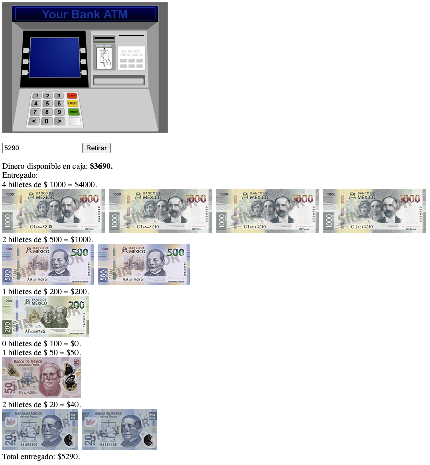

 # Cajero Automático

Bienvenido! 👋

Implementemos el algoritmo que creamos para un cajero automático.

Primero debemos crear nuestra estructura HTML, luego vamos a pasar nuestro algoritmo a código mira como hacerlo.

Recuerda:
- Los programadores dividen problemas grandes en varios pequeños.
- Prueba frecuentemente que el código escrito funciona
 
Desafíos:
- Toma el código y ahora muestra los billetes entregados con imágenes.
- Crear el código para ir guardando el estado de billetes del cajero y poder verlo visualmente
- Intenta optimizar el código que hemos escrito

